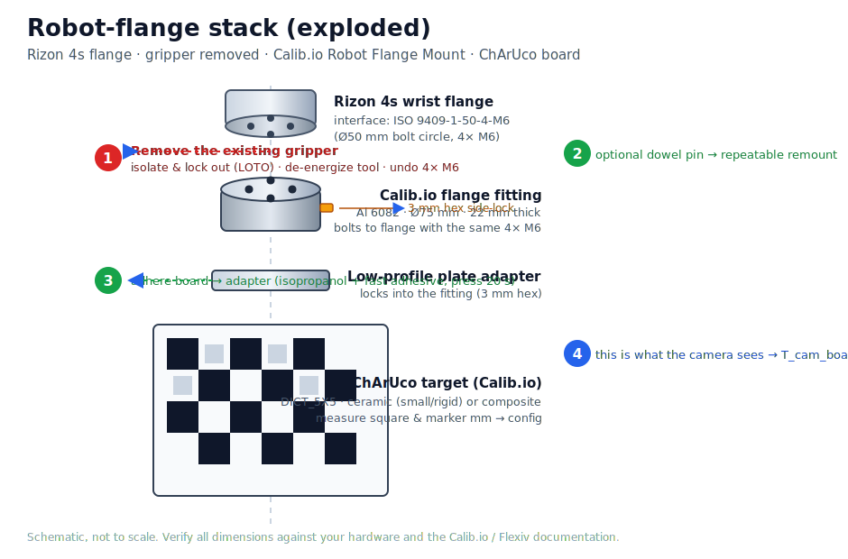
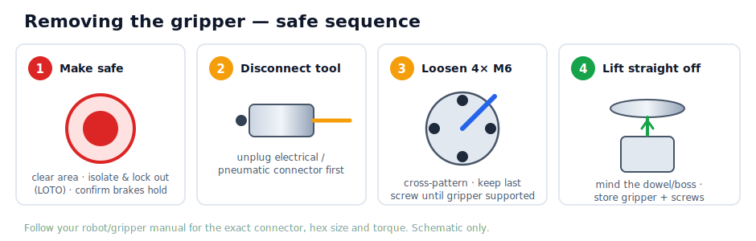
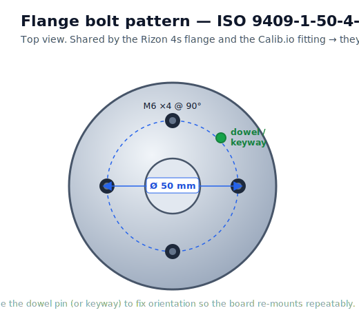
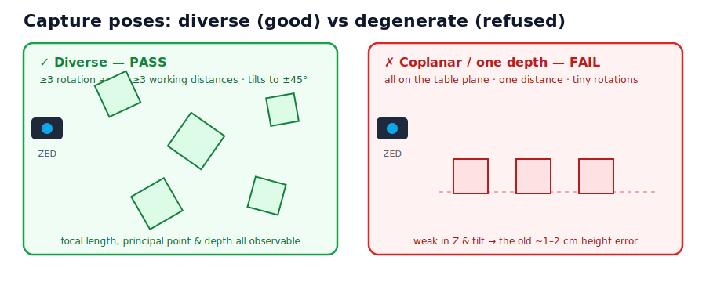

# Hardware setup — from gripper to a board on the flange

This page is the **physical** half of the calibration: how to take the gripper off your Flexiv Rizon,
bolt on the Calib.io **Robot Flange Mount**, attach the **ChArUco** target, and place the ZED 2i — so
the camera can see a board that is rigidly fixed to the moving flange (an *eye-to-hand* setup). When
the hardware is mounted, continue with the [Tutorial](TUTORIAL.md) for capture and solving.


!!! danger "Read this before touching the robot"
    Removing an end-effector is a real maintenance operation on a powerful, force-controlled arm.

    - **Clear the workspace** — no hands or people inside the robot's reach, before *and* after power
      changes.
    - **Lock out the energy — an E-stop is *not* enough.** Move the arm to a **low, well-supported
      posture** where a gravitational sag can't strike a person or surface, then **isolate and lock
      out** the robot's power per the **official Flexiv Rizon manual** and your site
      **lockout/tagout (LOTO)** procedure. An E-stop is a *stop* function, not energy isolation
      (OSHA 1910.147 excludes control-circuit devices as isolating devices). **Verify
      de-energization** (no motion possible) and ensure **no one can re-enable or jog** the arm while
      your hands are at the flange.
    - **Confirm the joint brakes hold.** The Rizon's holding brakes engage on power removal; *confirm
      the arm does not droop* before reaching in. **Do not rely on the servo/impedance hold — it
      vanishes when power is removed**, and a released brake can let this partially-backdrivable arm
      back-drive under gravity.
    - **Support the gripper from below — by its body, not the jaws** — or rest it on a block *before*
      the last screw comes out. A partly-engaged M6 is a thread-relief tip, **not** a load path; it
      will not arrest a dropping tool. Use a second person/fixture for a heavy gripper, and keep
      fingers out of the gripper-to-flange gap (pinch point).
    - **De-energize/depressurize the tool before disconnecting it** (Step 1), and **set the correct
      tool mass/TCP before the first move** after re-mounting (Step 8).
    - This guide gives the *general* sequence. **Exact connector, hex size, torque, and the E-stop /
      power-down / brake procedure come from your robot/gripper manual — follow them, not the round
      numbers here.**
    - All diagrams on this page are **schematics, not photos of your exact hardware.** Verify every
      dimension against the Calib.io and Flexiv documentation.

---

## What you need

| Item | What we use | Link / notes |
|---|---|---|
| Robot | Flexiv **Rizon 4s** | flange interface **ISO 9409-1-50-4-M6** (Ø50 mm bolt circle, 4× M6) |
| Camera | **ZED 2i** (fixed) | left stream is rectified; we *audit* its factory intrinsics |
| Calibration target | **Calib.io ChArUco** | <https://calib.io/products/charuco-targets> · `DICT_5X5` family |
| Flange mount | **Calib.io Robot Flange Mount** | <https://calib.io/products/robot-flange-mount> · ISO 9409-1-50-4-M6 *compatible*, Al 6082, Ø75 mm |
| Tools | hex keys (incl. the M6 size your flange screws use, e.g. 5 mm, and the **3 mm** for the mount's side-lock), torque wrench, calipers, isopropanol wipes (in the mount kit) | — |

!!! tip "Why the Calib.io mount bolts straight onto the Rizon"
    The Rizon 4s tool flange uses **`ISO 9409-1-50-4-M6`** and the Calib.io Robot Flange Mount is
    **`ISO 9409-1-50-4-M6`-compatible** — the same Ø50 mm bolt circle and 4× M6 pattern — so the
    mount's flange fitting attaches with the *same four bolts* that held your gripper. (Flexiv isn't in
    Calib.io's marketing compatibility list, but the ISO interface is what matters, and it matches.
    **Confirm your exact flange in the Flexiv spec sheet before ordering** — and measure the bolt
    circle yourself if in any doubt.)

---

## The full stack you're building



Top to bottom: **Rizon flange → Calib.io flange fitting → low-profile plate adapter → ChArUco board**.
The four steps below build this stack.

---

## Step 1 — Remove the gripper



1. **Make safe** (see the danger box): clear the area, park the arm in a low/supported posture,
   **isolate and lock out (LOTO)** the arm's power, **verify zero motion is possible**, and **confirm
   the joint brakes hold** (the arm doesn't droop). Do not treat the E-stop as the isolation step.
2. **Disconnect the tool — drive it to a verified zero-energy state first.** Never unbolt or unplug a
   tool that is still powered or pressurised.
    1. **De-energize the gripper's electrical/control power** so the jaws cannot actuate. If it's a
       pneumatic gripper with a *solenoid* valve, do this first so a stuck/last-state solenoid can't
       drive the jaw when you touch the air line.
    2. **Pneumatic gripper:** close the air supply, then **bleed/vent the residual pressure** to
       atmosphere and confirm zero pressure *before* disconnecting the line (a charged cylinder can
       snap the jaws — pinch hazard — and a pressurised quick-disconnect can whip).
    3. **Disconnect** the (now dead) electrical connector and the (now vented) air line.
3. **Loosen the 4× M6** flange screws (commonly a 5 mm hex for M6 socket-head cap screws — *check
   yours*) a little at a time in a **cross pattern**. **Support the gripper by its body from below
   first.** Keep your fingers out of the gripper-to-flange gap, and note the alignment dowel/boss can
   bind then release suddenly — be ready for a small lurch as it frees.
4. **Lift the gripper straight off** the flange, keeping it cradled from below so it can't cock or
   drop. Store the gripper **and its screws** together and cap any exposed connector.

!!! note "📷 Add your own photo here"
    A real photo of *your* gripper + its connector + the exact screw heads is the most useful
    illustration for this step. Take one, drop it in `docs/assets/photos/gripper.jpg`, and replace this
    block with ``. (We don't ship an AI-generated photo here on
    purpose — a fabricated image of a disassembly could mislead.)

---

## Step 2 — Identify and orient the flange



With the gripper off you'll see the bare **ISO 9409-1-50-4-M6** flange: four M6 holes on a Ø50 mm
circle around a centre boss, plus a **dowel hole / keyway** that fixes orientation. The Calib.io
fitting has the matching pattern.

!!! tip "Use the dowel for repeatable re-mounting"
    The Calib.io mount offers a **dowel pin** for "very repeatable remounting." If you'll swap the
    board on and off (you probably will — gripper for work, board for re-calibration), seat the dowel
    so the board returns to the *same* orientation every time. That keeps `T_flange_board` constant.

---

## Step 3 — Bolt on the Calib.io flange fitting

The fitting is **Aluminium 6082, Ø75 mm, 22 mm thick**. Mount it to the bare flange:

1. Seat the fitting on the flange, engaging the **dowel/keyway** for orientation.
2. Insert the **4× M6** screws and tighten in a **cross pattern**, in two passes, to the **torque your
   flange spec calls for** (don't guess — use the Flexiv value).
3. The low-profile **plate adapter** locks into the fitting and is **secured with a 3 mm hex key from
   the side** — snug it after the board is attached (Step 4) so you can set the board's clocking first.

!!! warning "Two different fasteners — don't confuse them"
    - **4× M6** (≈5 mm hex) attach the **fitting to the robot flange** — structural, torque to spec.
    - **3 mm hex set-screw** locks the **plate adapter into the fitting** from the side — this is the
      Calib.io quick-lock, *not* a flange bolt.

---

## Step 4 — Attach the ChArUco board

Calib.io ChArUco targets use the **`DICT_5X5`** marker family — but **confirm the exact dictionary on
your board's spec sheet/engraving** (the OpenCV enum is one of `DICT_5X5_50/100/250/1000`; the repo's
example config ships `DICT_5X5_100`, and Calib.io also offers custom boards, e.g. 4×4). They come in
two materials:

| Material | Sizes | Why pick it |
|---|---|---|
| **Ceramic** | 75×50, 100×75, 150×100 mm (3 mm) | **best for a flange board** — rigid, light, low thermal expansion (~7.2 µm/°C·m), feature accuracy **< 10 µm** |
| Aluminium/LDPE composite | 200×150 up to 800×600 mm (6 mm) | larger boards / fixed targets |

For a wrist-mounted board seen by a fixed camera at ~0.5–1 m, a **small ceramic target (100×75 or
150×100)** is ideal: rigid and light on the wrist. Prefer a **coarse pattern** (bigger checkers/markers)
for robust detection at distance.

Attach it to the plate adapter using the **adhesive method in the mount kit**:

1. Wipe the adapter and the board's back with the included **isopropanol wipes**; let dry.
2. Apply the included **fast-setting adhesive**, set the board square to the adapter, and **press
   firmly for ~20 seconds**.
3. Once the board is on, set its clocking and **lock the 3 mm side screw**.

!!! note "📷 Add your own photo here"
    Drop a photo of the finished board-on-flange at `docs/assets/photos/board-mounted.jpg`.

!!! warning "Matte, flat, and correctly measured"
    - Use a **matte** board/surface — a glossy mount blows out under the ZED's exposure and ArUco
      detection fails.
    - Keep it **flat and rigid** (ceramic is, by design). Non-flatness adds error proportional to the bow.
    - **Measure the real square and marker size with calipers** and enter those millimetres in the
      config (Step 6). The board's size sets the metric scale of *every* pose the calibration outputs.

---

## Step 5 — Place the ZED 2i

- Fix the ZED on a **rigid, static** mount (tripod/clamp) looking at the robot's working volume. It
  must **not move** during the whole capture session.
- Put it at roughly the **working distance** of your real task, so the calibration is best where you
  use it.
- Make sure the arm can present the board across the camera's field of view at **several distances and
  tilts** without the camera or board leaving frame (that's what Step 7 needs).

---

## Step 6 — Tell `zfcc` about your board

Read your board's label / Calib.io spec sheet and edit
[`configs/board_calibio_9x14.yaml`](https://github.com/ZihaoLu001/zed-flexiv-charuco-calib/blob/main/configs/board_calibio_9x14.yaml):

```yaml
board:
  squares_xy: [COLS, ROWS]   # (squaresX, squaresY) -- the order matters; see the day-one mistakes
  square_length_m: 0.0XX     # the checker side you measured, in metres
  marker_length_m: 0.0XX     # the marker side you measured, in metres
  aruco_dict: DICT_5X5_100   # the exact DICT_5X5_* enum your board uses (confirm on the spec sheet)
  legacy_pattern: null       # null = auto-resolve the OpenCV 4.6 parity flag on first capture
```

!!! warning "The shipped `board_calibio_9x14.yaml` is a *placeholder*"
    Its `14×9 / 40 mm` values describe a ~560×360 mm **composite** board — that is **not** the small
    ceramic target recommended for the wrist in Step 4. Replace every value with **your** board's
    measured numbers. For a wrist-mounted board, that's a small ceramic (100×75 or 150×100); its grid
    and square/marker sizes will be much smaller than the placeholder's.

Then render it and **check it against the physical board square-by-square** before capturing:

```bash
zfcc-render-board --board configs/board_calibio_9x14.yaml --out board.png
```

---

## Step 7 — Capture, solve, validate


Now run the software pipeline. Capturing **diverse** poses is the step that decides accuracy:



```bash
# 1. capture diverse poses (board on the flange, ZED fixed)
zfcc-collect --session runs/s001 --board configs/board_calibio_9x14.yaml \
             --zed configs/zed_2i_hd720.yaml --robot configs/rizon4s.yaml --mode manual
# 2. check coverage/diversity BEFORE leaving the robot
zfcc-inspect --session runs/s001
# 3. solve + validate -> writes T_base_zed2i.yaml only if the verdict isn't FAIL
zfcc-solve --session runs/s001 --board configs/board_calibio_9x14.yaml --out T_base_zed2i.yaml
# 4. physical end-to-end check (manual ruler measurement)
zfcc-touch-test --calib T_base_zed2i.yaml --board configs/board_calibio_9x14.yaml \
                --zed configs/zed_2i_hd720.yaml --corner 0
```

The full, annotated version of these steps — pose recipe, what the verdict means, how to read the
metrics — is in the **[Tutorial](TUTORIAL.md)**.

---

## Step 8 — Swap the gripper back

When the calibration passes, reverse Step 1–3: remove the board/fitting (or just the plate adapter, if
you dowel-located it), refit the gripper with its 4× M6 to the **flange torque spec**, reconnect its
cabling, and power back up per the Flexiv procedure. If you used the dowel, the board can be remounted
later without re-calibrating `T_flange_board`.

!!! danger "Re-energize safely — the gripper is a different tool than what was last configured"
    Before powering back up: **clear the workspace** of hands and people. After re-mounting, **set the
    correct tool mass / TCP / centre of gravity in Flexiv Elements for the gripper** *before any
    motion* — the board fitting was the last tool configured, so that payload is now stale, and a wrong
    tool weight degrades gravity compensation on this force-controlled arm (it can move unexpectedly or
    trip a protective stop). Make the **first commanded move slow, with a hand on the E-stop**.

---

## Troubleshooting the hardware

| Symptom | Likely cause | Fix |
|---|---|---|
| Mount won't seat flush | dowel/boss not aligned, or debris on the flange face | clean the face; align the dowel/keyway first |
| Board shifts between poses | adhesive not cured, or side-lock loose | re-press 20 s; tighten the 3 mm side screw |
| Zero ArUco detections | glossy board, wrong dictionary, or bad lighting | matte surface; confirm `DICT_5X5`; even, diffuse light |
| Calibration off by a constant scale | wrong square/marker size in config | re-measure with calipers; enter true mm |
| Board droops / vibrates on the wrist | board too big/heavy for the arm | use a smaller ceramic target |

---

*Diagrams here are hand-authored SVG schematics (so nothing about the hardware is fabricated). Replace
the 📷 placeholders with real photos of your setup to make this page fully your own.*
