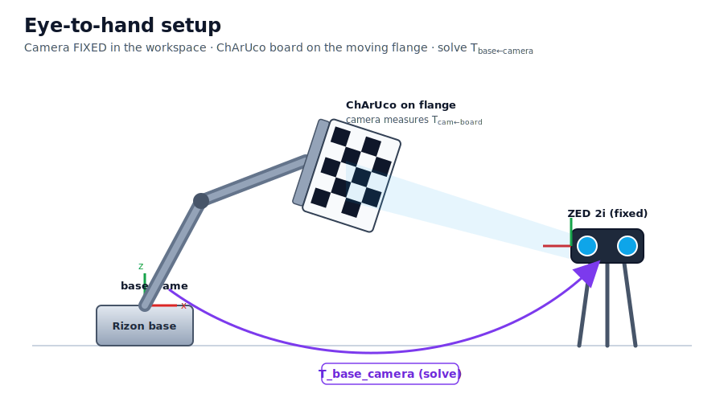
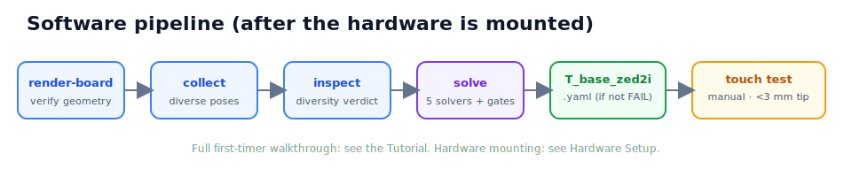

# ZED 2i ↔ Flexiv Rizon ChArUco calibration

**Strict eye-to-hand calibration between a fixed ZED 2i camera and a Flexiv Rizon arm, using a ChArUco
board on the flange — with an illustrated hardware-setup guide and a falsifiable validation suite.**

It recovers the fixed rigid transform **`T_base_camera`** (where the camera sits in the robot base
frame) so a 3D point the camera sees can be commanded directly in robot coordinates — the number a
grasp pipeline depends on. The output is a drop-in `T_base_zed2i.yaml`.

- :material-wrench: **New to the hardware?**
  Start with the **[Hardware setup guide](HARDWARE_SETUP.md)** — remove the gripper, bolt on the
  Calib.io flange mount, attach the ChArUco board, place the ZED. Fully illustrated.

- :material-school: **First calibration?**
  The **[Tutorial](TUTORIAL.md)** walks you end-to-end (capture → solve → validate → touch test) with
  the four day-one mistakes and honest "standard vs repo-chosen" labels.

## Why it exists

This replaces an ad-hoc calibration from **8 coplanar ArUco markers on a table**. That layout is
*planar*: PnP is accurate in the image plane but weak in depth/tilt, so the camera pose can be off by
**1–2 cm in Z** while every on-screen check looks perfect. This project makes that failure mode
**impossible to ship silently** — a pose-diversity gate refuses a near-coplanar set and a five-solver
cross-check must agree before a calibration is written; a manual touch test then confirms the whole
chain on the robot.

## The pipeline

## Does a ChArUco board also give camera intrinsics? — Yes

One board does both jobs: full pinhole intrinsics (`fx, fy, cx, cy` + distortion, with per-parameter
uncertainties via `calibrateCameraExtended`) **and** the board pose for hand-eye. For the ZED
specifically, the left stream is already *rectified* against a factory `K` the depth engine uses, so
intrinsics default to an **audit** of that `K` rather than overwriting it. See [Versions](VERSIONS.md)
and [Method](METHOD.md).

## Hardware

- **Calibration target (ChArUco):** <https://calib.io/products/charuco-targets> — `DICT_5X5`.
- **Robot Flange Mount:** <https://calib.io/products/robot-flange-mount> — `ISO 9409-1-50-4-M6`,
  matching the Rizon 4s flange.

## At a glance

- Eye-to-hand via `cv2.calibrateHandEye` on **inverted** flange poses (5 solvers, **DANIILIDIS**
  primary) + an independent `calibrateRobotWorldHandEye` cross-check.
- **Gates that actually refuse the write:** pose diversity (≥3 axes, ≥3 depths, non-coplanar), AX=XB
  residual, leave-one-out stability, cross-solver agreement.
- Reads the **flange** pose, not the TCP. Drop-in `T_base_zed2i.yaml`.
- **81 hardware-free tests**, ruff-clean, CI on Python 3.9 / 3.11 / 3.12.

> Full source on [GitHub](https://github.com/ZihaoLu001/zed-flexiv-charuco-calib) · Apache-2.0.
